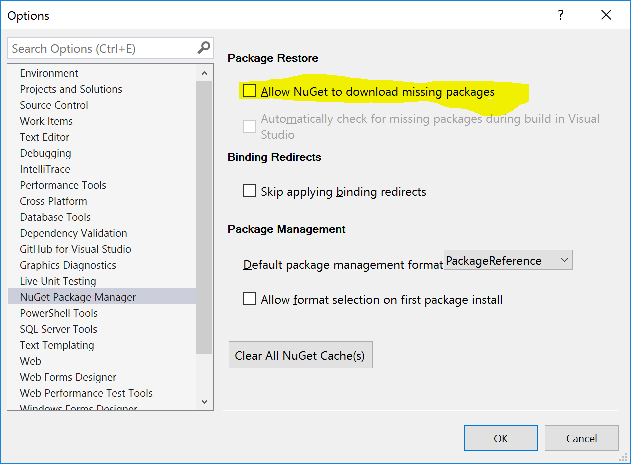

# Contributing

This project has adopted the code of conduct defined by the Contributor Covenant to clarify expected behavior in our community.
For more information see the [.NET Foundation Code of Conduct](https://dotnetfoundation.org/code-of-conduct).

There are many thousands of Win32 APIs and this library is not complete.
Please send pull requests to add what you've come up with.

## Prerequisites

### Required

* [Visual Studio 2019](https://www.visualstudio.com) with the workloads/components
  specified in the src\.vsconfig file. This is a configuration you can import using the VS installer in order to quickly get the required components installed.
* The version of the .NET Core SDK specified in [global.json](global.json). This will be installed by the `init.ps1` script.
  Use the `-InstallLocality Machine` parameter when invoking that script to install the .NET Core SDK at the machine-wide location
  so that Visual Studio can reliably find it and load the projects.

## Guidelines

### How to build

Run the init script at the root of the repo. Run `init -installlocality machine` from an elevated prompt.

The `build.ps1` script at the root of this project will restore packages, build, and run tests.
With the appropriate switch, this script will perform a subset of these functions.

### Important notices when developing with Visual Studio

Consider using Visual Studio Code or Visual Studio's Open Folder feature instead of opening
the PInvoke.sln in Visual Studio 2019. In exchange for fewer features, you'll have a more responsive UI.

If you proceed to open the solution in Visual Studio, the following workarounds are necessary:

#### Workaround [NuGet/Home#4764](https://github.com/NuGet/Home/issues/4764)

The NuGet package restore functionality in Visual Studio does not work for this project,
and the relevant bugs in VS are tracked at https://github.com/dotnet/pinvoke/issues/314.
You should disable automatic package restore on build in Visual Studio in order to build
successfully and have a useful Error List while developing.

Follow these steps to disable automatic package restore in Visual Studio:

1. Tools -> Options -> NuGet Package Manager -> General
2. *Clear* the checkbox for "Automatically check for missing packages during build in Visual Studio



With this setting, you can still execute a package restore within Visual Studio by right-clicking
on the _solution_ node in Solution Explorer and clicking "Restore NuGet Packages". But do not
execute that on the solution in this repo as that will corrupt the result of `build.ps1 -restore`.

Before developing this project in Visual Studio, or after making project or package reference changes,
or to recover after Visual Studio executes a package restore, run this command, which is defined
at the root of the repo, from the Visual Studio Developer Command Prompt:

```
.\build -Restore
```

#### Workaround Intellisense errors

The C# language service will sometimes reports many errors that are not "real".
Waiting for VS to "settle" (sometimes a couple minutes) can sometimes help. Other times, building the solution
can cause the error list to clear out and the red squigglies to go away.

The most sure way to eliminate the errors is to run `.\build -restore -build` from
the command line before opening in Visual Studio.

### Frequently Asked Questions

#### Can p/invoke signatures and docs found on pinvoke.net be copied into this project?

[The license found on pinvoke.net](http://www.pinvoke.net/termsofuse.htm#3.4) for its code grants users:

> a licence to copy, use, adapt, modify or distribute that source code as they see fit, provided that the source code may not be used in any unlawful, defamatory, obscene, offensive or discriminatory way.

I'm not a lawyer, but I read that to mean contributing the code to an MIT licensed project such as
this one would be permissible. In addition, folks on pinvoke.net did not invent the method signatures
in the first place, as they are a work of the author of the original library being P/Invoked into.

### Learn how to write P/Invoke signatures

The [sigimp tool][SigImp] will automatically generate P/Invoke signatures for most Win32 functions
and interop types. Use it to save time and improve accuracy as we collect these signatures into these
reusable libraries. But try to cut down the verbose output that may be produced by a tool.
And always double-check the generated code because these tools are known to sometimes misinterpret
parameter types.

A great resource for accurate p/invoke signatures and structures with a compatible OSS license
comes from the .NET team: https://github.com/dotnet/runtime/tree/master/src/libraries/Common/src/Interop/Windows

Remember whether you write the signatures yourself or use a tool, to follow the rest of the guidelines
in this document.

### Project structure

 * One class library per P/Invoke'd DLL.
 * Types, enums, and constants defined in common Windows header files should be defined
   in the PInvoke.Windows.Core project.

When introducing support for a new native DLL to this project, use the `templates\AddNewLibrary.ps1`
Powershell cmdlet to create the projects necessary to support it and follow the instructions from that script.

Sometimes it might be needed to add libraries to share types and structures among high-level API sets.
When that happens you should use the `templates\AddNewCoreLibrary.ps1` Powershell cmdlet to create a core library.

A Core Library in PInvoke project wording is a library that only contains enums and structures, no functions, classes or methods.
These libraries are not backed by DLLs, instead they are based on C/C++ header files (.h files). They are meant to be used
when enums and structures must be shared among other high level projects, like PInvoke.SHCore and PInvoke.User32
share types using Windows.ShellScalingApi.

Core Libraries should be named after their C/C++ header file names like ShellScalingApi.h

The high-level libraries should also be added to the list on the [readme](README.md).

### Win32 API Sets

When developing a library for Win32, be aware of [API Sets][APISets] and follow the pattern in
[Kernel32.cs](src/Kernel32.Shared/Kernel32.cs) to use them in the portable project but not for the
"desktop" targeted project.

Be sure to use the *lowest* version of the API Sets facade that includes your function.
For example, `FormatMessage` appears in `api-ms-win-core-localization-l1-2-1.dll` according to
[Windows API Sets][APISets] but appears under `api-ms-win-core-localization-l1-2-0.dll`
under the older [Windows 8 API Sets][APISets8] page. So we use the older so it works as well on
Windows 8 as it does on newer Windows versions.

### File structure

 * Nested classes and structs go into their own files.
 * P/Invoke methods go into the *libname*.cs file. While higher level helper methods go in *libname*.Helpers.cs.

### Naming

 * Name the class with the P/Invokes after the DLL. The namespace should be `PInvoke`
   and should not be appended with the DLL name.
 * Types introduced to support the P/Invoke methods (e.g. enums, structs, etc.)
   should be nested types within the class named after the DLL.
 * All method names should match exactly their names as found in the native DLL.
   Do not remove a common prefix even if it is redundant with the class name.
   This is for predictability across the entire family of libraries and so
   searches for method names as they are found in the native libraries' documentation
   will always turn up results if they are defined by these packages.
 * Preserve the original parameter names.
 * For flags used in parameters, use the same enum name as the docs/header file if it defined.
   Where no enum name is given, we prefer to create an enum called *MethodName*Flags.
   When the enum may be used by multiple p/invoke methods, give it a name that captures its scope
   so that it makes sense to be used in any method that uses it.
   If the names of the relevant constants all share a prefix, consider using that prefix as the
   basis for the enum name.

There is a tension between keeping names consistent between native and managed code,
and conforming to common .NET naming patterns such as camelCase and PascalCase.
For this project, we preserve names of methods, parameter values, constants, and
anything else found in native header files for these reasons:

1. A predictable API tends to be more useful and appreciated by its users. While we
   can make some names look more .NET-like, we cannot do it for all of them. This
   leads to inconsistencies and thus unpredictability for our users.
1. Keeping the names the same empowers users to share code more freely between native
   and managed code. They can more confidently share code snippets on forums
   where those more familiar with the native library will recognize the names used.
1. Discoverability of APIs by consistency with documentation. When someone is searching
   for the definition of a method, an enum value or struct in this project based on
   the name from native code or documentation, they'll find it if it's there.
1. Documentation of methods and parameter usage will match with the P/Invoke methods'
   signatures, leading to quicker understanding of how to use these APIs properly.
1. Changing names from their native definitions requires some judgment calls be made,
   which can lead to potentially long discussions during pull requests while folks
   debate the merits of various options. We prefer to spend time adding more APIs
   over ever-repeating discussions on code reviews.

### Method parameter types

 * Prefer `SafeHandle`-derived types to `IntPtr` when dealing with handles.
   Mark P/Invoke methods that destroy handles private because they will necessarily take `IntPtr`
   and the pattern for users should be to `Dispose` of your `SafeHandle`.
 * Use native pointers instead of `IntPtr`. We have automatic code generation in place during the build
   to create `IntPtr` overloads of these methods. The only known exception where `IntPtr` is OK
   to use directly is when the value isn't actually a pointer that should ever be dereferenced (e.g.
   a handle that is only ever returned back to the library that produced it).
 * When a native method accepts a pointer to an array of structs, use `struct*` as the parameter type
   and add `[Friendly(FriendlyFlags.Array)]` to that parameter (the attribute is not necessary on `byte*`).
   The code generator will then produce an overload that takes `struct[]` for you.
 * When a native method accepts a pointer to a single value, you may optionally add this attribute to the
   parameter with more or less flags: `[Friendly(FriendlyFlags.In | FriendlyFlags.Optional)]` which leads
   to the code generator producing `struct?`, `ref struct`, or `ref struct?` overloads for that parameter.
 * When using `bool`, remember that .NET defaults to treating that as a 4-byte integer,
   which is equivalent to explicitly specifying `[MarshalAs(UnmanagedType.Bool)]` and is appropriate for the native `BOOL` type.
   Use `UnmanagedType.U1` when native code uses just 1-byte for its boolean value.
   [Learn more](https://docs.microsoft.com/en-us/visualstudio/code-quality/ca1414?view=vs-2019).
 * Prefer `enum` types over `int` or `uint` for flags. Generally, name flags enums as `METHODNAMEFlags`.
   For example: `CreateFileFlags` for the flags that are passed to `CreateFile`.
 * Use `IntPtr` for integers that change size based on process architecture (32-bit vs. 64-bit).
   Use `int` or `long` for integers that are always either 32-bit or 64-bit (respectively).
   All PInvoke assemblies are architecture neutral, so we rely on `IntPtr` to accomodate the size of integer
   types that vary with architecture. An [exhaustive list of equivalent types are available on MSDN](https://msdn.microsoft.com/en-us/library/windows/desktop/aa383751).
   Some helpful translations are included in the following table. Find more [in Microsoft documentation](https://docs.microsoft.com/en-us/dotnet/standard/native-interop/best-practices#common-windows-data-types).

| C/C++ type  | C# type   |
| ----------- | --------- |
| `short`     | `short`   |
| `WORD`      | `ushort`  |
| `DWORD`     | `uint`    |
| `int`       | `int`     |
| `long`      | `int`     |
| `long long` | `long`    |
| `LONG_PTR`  | `IntPtr`  |
| `UINT_PTR`  | `UIntPtr` |
| `SIZE_T`    | `UIntPtr` |
| `SSIZE_T`   | `IntPtr`  |
| `LPARAM`    | `IntPtr`  |
| `WPARAM`    | `IntPtr`  |
| `LRESULT`   | `IntPtr`  |

### Structs

Tip: Avoid adding `[StructLayout(LayoutKind.Sequential)]` to your structs,
as [this is the default in C#](https://docs.microsoft.com/en-us/dotnet/api/system.runtime.interopservices.structlayoutattribute?view=netcore-3.1#remarks) and thus just more verbose than necessary.
You may need the attribute to add additional properties however, such as forcing a particular `Pack` property or `CharSet`.

#### Field types

When defining a struct, we should take care to make sure the struct is 'pinnable' (i.e. all fields must be
value types rather than reference types.) Benefits of structs being pinnable include:

1. Pointers are allowed (e.g. `YourStruct*`) and thus can be used as an optional parameter in methods.
1. The original native pointers in fields are preserved (they are not marshaled) thus ensuring that if
   native code allocated memory and will later free it, the same pointers will be observed when you pass
   the struct back to native code to free it.
1. No need `[MarshalAs]` attributes, and no marshaling *can* mean improved performance for some scenarios.
1. It is consistent with the rest of the library's guidelines that the signatures closely match to their
   native header file representations.

Pinnable structs cannot have a `string` field, since `string` is a reference type. Instead, you can add a
`string` *property* for convenience. See [PROCESSENTRY32][PROCESSENTRY32] for an example of this for a
fixed-size character array, or [BCRYPT_ALGORITHM_IDENTIFIER][BCRYPT_ALGORITHM_IDENTIFIER] for an example
of this for a variable length, null-terminated string.

When a struct has pointer types for fields, add an `[OfferIntPtrPropertyAccessors]` attribute to the struct.
This causes `IntPtr` property accessors to these pointer fields to be automatically generated,
making the struct accessible to languages that do not support pointers (e.g. VB.NET) or simply more convenient
to callers with an `IntPtr`.

### Helper methods

Helper methods should be kept at a minimum. The scope of this P/Invoke library is primarily
to make native methods accessible from managed code -- not to create a high-level API that
uses the native binary as an implementation detail. Think of helper methods as filling in
where .NET interop marshaling falls short.

Helper methods should usually appear as overloads of the P/Invoke methods by sharing their
method name with the method they wrap. The "raw" P/Invoke method should also be `public`
so callers who may have very particular requirements can skip the helper method.

Helper methods are an excellent addition when one or more of these conditions are true
of the P/Invoke method they wrap:

1. The method requires special memory allocations and deallocations of the caller,
   or requires multiple calls to determine the size of the buffer then fill it.
1. The method has a single out parameter that in a naturally managed API would typically
   serve as the return value, and the P/Invoke method's return value is void or an error code.
1. A set of methods for enumeration can be wrapped with a helper that exposes an IEnumerable.
1. Exposing asynchrony as a .NET Task via an async method.

Helper methods should *not*:

1. Merely translate an error code to an exception.
   But if a helper method exists for other reasons, it is appropriate to throw instead of return
   an error code when the helper method uses its return value for something else.
1. Cater to specific use cases. This purpose should be reserved for an external project that focuses
   on raising the abstraction layer for the native library.

When a helper method does not exactly match the name of a P/Invoke method (e.g. enumerator
or async helpers) the name should blend the method naming patterns of the native library
with .NET conventions. For example, `EnumerateFiles` or `CreateFileAsync`.

### Xml documentation

We do not require it, but we encourage xml doc comments for all P/Invoke and helper methods
because it shows up in Intellisense and can aid users in coding against these APIs.
This documentation may be copied (where licensing allows) from the native library's own
documentation. We consider MSDN an allowable source of documentation.

Consider touching up the docs you copy or author by adding `<see cref="..." />` around
references to other methods and `<paramref name="..." />` for references to parameters.

#### Practical advice for copying documentation

When copying and pasting multiple paragraphs of documentation into an
xml doc comment you might start with this:

```csharp
    /// <summary>
    /// [PASTEHERE]
    /// </summary>
```

The C# language service will often paste something like this:

```csharp
    /// <summary>
    /// First line of documentation
    Second line of documentation.With missing space after sentences.
    Third line.With more missing spaces
    /// </summary>
```

Notice not only the missing `///` but that sentences are missing a space between each other
on subsequent lines. The easiest way to fix this is to get in the habit of pasting by:
Ctrl+V, Ctrl+Z. The Undo command will not revert the paste, but it will revert the formatting
that the language service applied. Which turns the above paste to this:

```csharp
    /// <summary>
    /// First line of documentation
Second line of documentation. With missing space after sentences.
Third line. With more missing spaces
    /// </summary>
```

Which you can then use block selection (alt+shift) followed by `///` to add the missing
slashes to every line at once, saving time. Once the commenting slashes are in place,
press Ctrl+K, Ctrl+D to execute the Format Document command to fix up the indentation
and anything else that can be automatically fixed.

### StyleCop

We have StyleCop.Analyzers installed to all our projects with the set of rules that we
generally want to follow. They appear as build warnings, so please check for those
before submitting pull requests and clear up any warnings you've introduced.

In some cases, such as when we use a class instead of a struct,
we will have public fields for interop marshaling reasons. The StyleCop rule that dislikes
this can be suppressed by adding this near the top of your file:

```csharp
#pragma warning disable SA1401 // Fields must be private
```

### RS0016 warnings or RS0017 errors in the build

To guard against breaking API changes, we leverage the `Roslyn.Diagnostics.Analyzers`
which track the public API we have shipped (or added but not yet shipped).
When you remove a member of the public API, build error RS0017 occurs.
When you add a member to the public API, build warning RS0016 lets you know you need to
update the PublicAPI.Unshipped.txt file with your new member. This is so that if your
new API is removed later, it can generate an RS0017 error.

Use the analyzer's automatic code fix in Visual Studio 2019 to update the file and
include that file change in your commit.
You must have `net45` selected as the target framework in the Visual Studio editor for the
code fix to be offered.

### SafeHandles

Safe handles should follow a few rules:

* They should have an empty constructor that does nothing. (The marshaller will use this one when it need to create a SafeHandle)
* They should have a constructor allowing to reuse pre-existing handles.
* They should have a static field for each invalid values for easy access.

A good example would be [`SafeHookHandle.cs`](src/User32/User32+SafeHookHandle.cs).

[SigImp]: https://devblogs.microsoft.com/vbteam/making-pinvoke-easy/
[APISets]: https://msdn.microsoft.com/en-us/library/windows/desktop/hh802935(v=vs.85).aspx
[APISets8]: https://msdn.microsoft.com/en-us/library/windows/desktop/dn505783(v=vs.85).aspx

[PROCESSENTRY32]: https://github.com/dotnet/pinvoke/blob/b0cb7c1698d92193c58ce32209de5236a4f6bc9d/src/Kernel32/storebanned/Kernel32%2BPROCESSENTRY32.cs#L81
[BCRYPT_ALGORITHM_IDENTIFIER]: https://github.com/dotnet/pinvoke/blob/b0cb7c1698d92193c58ce32209de5236a4f6bc9d/src/BCrypt/BCrypt%2BBCRYPT_ALGORITHM_IDENTIFIER.cs#L18
